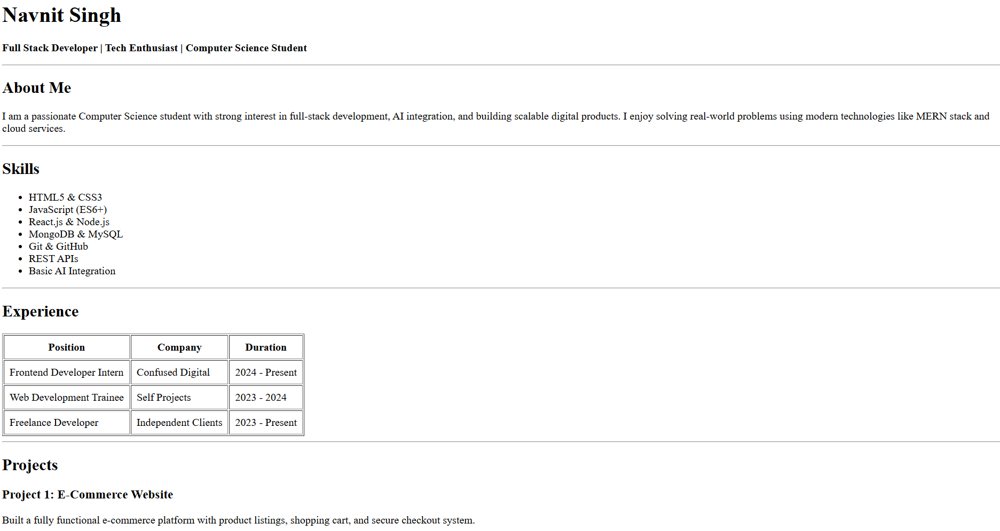

# HTML Resume Website

A simple single-page resume website built using pure HTML.  
This project was created as part of a web development assignment to practice HTML structure and semantic elements.

---

## 🚀 Features

- Clean single-page layout
- Sections for About, Skills, Experience, Projects, Education, and Contact
- Structured using semantic HTML tags
- Beginner-friendly code
- Easy to modify and extend

---

## 🛠️ Tech Stack

- HTML5

---

## 📂 Project Structure

```
html-resume/
│
├── index.html
└── README.md
```

---

## ⚙️ Setup Instructions

1. Clone the repository

```
git clone https://github.com/navnit1248/html-resume.git
```

2. Open the project folder

```
cd html-resume
```

3. Open `index.html` in your browser

You can simply double click the file or right click → Open with browser.

---

## ▶️ Usage

- View resume layout in browser
- Edit content inside HTML file to customize
- Add CSS later for styling (optional future improvement)

---

## 📸 Screenshots


Example:



---

## 📚 What I Learned

- Basic HTML structure
- Using tags and elements properly
- Creating tables and lists
- Organizing content into sections
- Importance of semantic HTML


## 👨‍💻 Author

Navnit Singh  

GitHub: https://github.com/navnit1248

